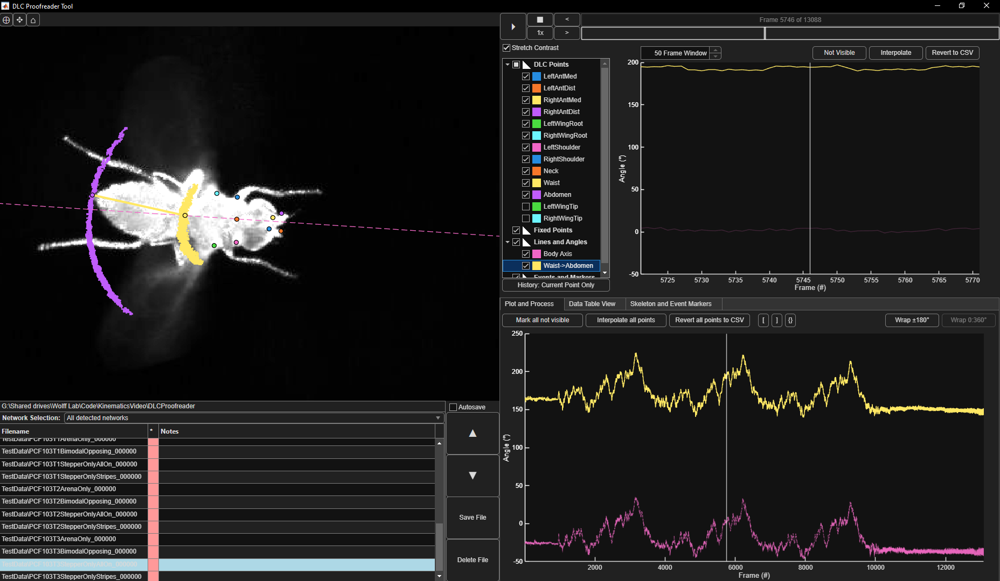

DLCProofreader is a standalone MATLAB program for revising and annotating tracking data generated with [DeepLabCut.](https://github.com/DeepLabCut/DeepLabCut)

This "proofreading" step can be helpful for validating good tracking and correcting / conditioning data with poor tracking in a small proportion of frames. The program also allows for an independent skeleton visualization (separate from the one included in a DLC network's config file), joint angle measurements relative to tracked or static points in the image, and manual definition and annotation of video events.

While usable, it is not (yet) well documented and has some serious bugs. Most notably the resize function does not do a good job of boundary-condition checking at lower resolutions. Runs best maximized at 1600x900 and up.
